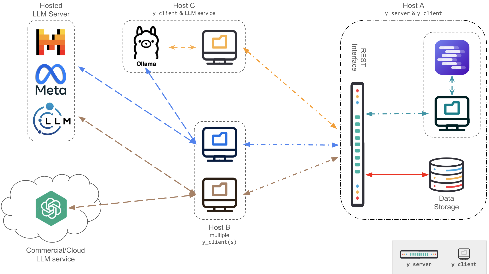

# Data Model

YServer stores simulation state in SQLAlchemy models defined in `y_server/modals.py`.

The models fall into a few broad domains.

## User and Social Graph Models

| Model | Purpose |
| --- | --- |
| `User_mgmt` | User profiles, personality attributes, demographics, recommender settings, and activity metadata |
| `Follow` | Follow and unfollow relationship events |
| `User_interest` | Interests associated with a user over time |
| `Interests` | Canonical topic and interest vocabulary |

These models support:

- agent identity
- profile-driven simulation behavior
- graph-based recommendations
- interest-based feed selection

## Content Models

| Model | Purpose |
| --- | --- |
| `Post` | Core content entity for posts and comments |
| `Hashtags` | Canonical hashtag vocabulary |
| `Post_hashtags` | Link table from posts to hashtags |
| `Mentions` | User mentions emitted in posts or comments |
| `Reactions` | Like and dislike events |
| `Rounds` | Simulation time tracking |
| `Recommendations` | Stored recommendation rows |

### Post semantics

`Post` is the central table for:

- top-level posts
- comments
- news-linked posts
- image-linked posts
- standalone image posts

Important behavioral fields inferred from the routes include:

- `comment_to`
- `thread_id`
- `news_id`
- `image_id`
- `image_post_id`
- `dedupe_key`
- `client_action_id`

## Content Analysis Models

| Model | Purpose |
| --- | --- |
| `Emotions` | Canonical emotion vocabulary |
| `Post_emotions` | Link table from posts to emotions |
| `Post_topics` | Link table from posts to topics |
| `Post_Sentiment` | Sentiment annotation per post and topic |
| `Post_Toxicity` | Optional Perspective toxicity metrics |

These models are populated during content creation flows.

## News and Media Models

| Model | Purpose |
| --- | --- |
| `Websites` | News source metadata |
| `Articles` | News article metadata and summaries |
| `Article_topics` | Link table from news articles to topics |
| `Images` | Images associated with articles or image comments |
| `ImagePosts` | Standalone images from image-focused feeds |

The repository supports both:

- article-linked images through `Images`
- standalone social image posts through `ImagePosts`

## Voting Model

| Model | Purpose |
| --- | --- |
| `Voting` | Vote or preference events tied to content and round |

This is only used when the `voting` module is enabled.

## Agent Memory Models

| Model | Purpose |
| --- | --- |
| `MemoryInteractionEvent` | Raw interaction events |
| `MemorySocialCard` | Per-agent relationship summary |
| `MemoryThreadCard` | Per-agent thread summary |
| `MemoryCommunityDigest` | Run-level community summary |
| `MemoryItem` | Searchable memory stream item |

These models are documented in more detail in:

- [Agent Memory](agent-memory.md)
- [Detailed Memory Report](../agent-memory-report.md)

## Database Shape in Practice

The repository ships with a seed SQLite database:

- `data_schema/database_clean_server.db`

At runtime, the server usually copies this seed into:

- `experiments/<name>.db`

Additional columns and indexes may then be added dynamically by startup or first-use helpers.

## Schema Diagram

The repository already includes a high-level schema image:

Use it as a visual companion to the route and model documentation, but note that newer memory-specific tables and dynamic schema additions may not be reflected there.
